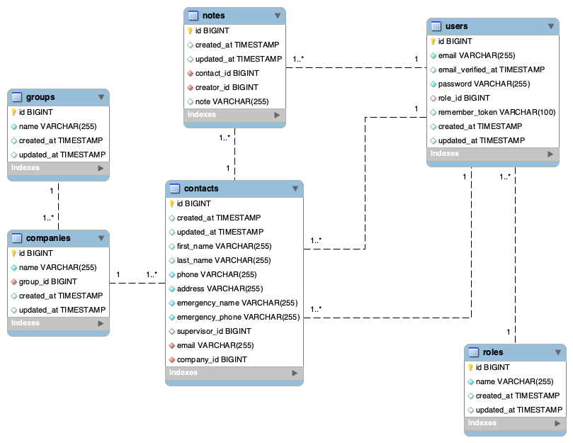

# Contact List PHP server

This is the backend server for Contact List App. This server uses [Laravel](https://laravel.com) framework. It can be run within [Homestead](https://laravel.com/docs/10.x/homestead)

### Start server

```
php artisan serve
```

### DB migration and seeding

```
php artisan migrate:fresh --seed
```

### Configuration for using with Homestead

-   Copy the content of .evn.example into .env

#### DB config

```
# .env

DB_CONNECTION=mysql
DB_HOST=localhost
DB_PORT=33060
DB_DATABASE=homestead
DB_USERNAME=homestead
DB_PASSWORD=secret
```

#### Homestead config

```
# Homestead.yaml

folders:
    - map: ~/.../contact-list-backend           # project folder directory
      to: /home/vagrant/contact-list-backend

sites:
    - map: homestead.test
      to: /home/vagrant/contact-list-backend/public

databases:
    - homestead

features:
    - mysql: true
services:
    - enabled:
          - "mysql"

ports:
   - send: 33060 # MySQL
     to: 3306
```

### Testing

-   Update the database config in .env file

```
DB_CONNECTION_TESTING=mysql
DB_HOST_TESTING=localhost
DB_PORT_TESTING=33060
DB_DATABASE_TESTING=your_testing_db
DB_USERNAME_TESTING=your_username
DB_PASSWORD_TESTING=your_password
```

-   Make sure laravel database configuration is updated

```
'mysql_testing' => [
            'driver' => 'mysql',
            'url' => env('DATABASE_URL'),
            'host' => env('DB_HOST_TESTING', '127.0.0.1'),
            'port' => env('DB_PORT_TESTING', '3306'),
            'database' => env('DB_DATABASE_TESTING', 'forge'),
            'username' => env('DB_USERNAME_TESTING', 'forge'),
            'password' => env('DB_PASSWORD_TESTING', ''),
            'unix_socket' => env('DB_SOCKET', ''),
            'charset' => 'utf8mb4',
            'collation' => 'utf8mb4_unicode_ci',
            'prefix' => '',
            'prefix_indexes' => true,
            'strict' => true,
            'engine' => null,
            'options' => extension_loaded('pdo_mysql') ? array_filter([
                PDO::MYSQL_ATTR_SSL_CA => env('MYSQL_ATTR_SSL_CA'),
            ]) : [],
        ],
```

* Run migration
```
php artisan migrate:fresh --database=mysql_testing
```

* Run test
```
php artisan test
# or
vendor/bin/phpunit
```

## Model

-   User: Used for authentication with email and password.
-   Contact: Has one to one relationship with User as each user will have one contact information record.
-   Role: Role of user. Used for authorisation.
-   Company: Company information of user, reference stored in contact record.
-   Group: Group that a company belongs to.
-   Note: Store notes maded by user on contacts.



## About

This is the backend for [Contact List application]().
Contact List app is used to manage contact information for companies with view, filter and sort features. Also, user can add note to each contact record which is inaccessible to other users.
